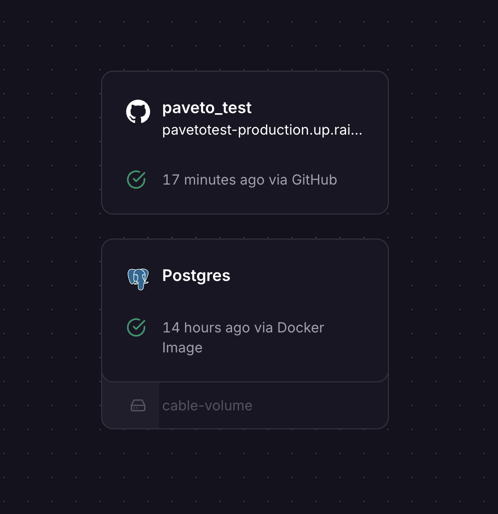

# Задание:

Реализовать сервис по загрузке аудио-файлов от пользователей, используя FastAPI, SQLAlchemy и Docker. Пользователи могут давать файлам имя в самом API.
Авторизацию пользователей реализовать через Яндекс.
Файлы хранить локально, хранилище использовать не нужно.
Использовать асинхронный код.
БД - PostgreSQL 16.

## Ожидаемый результат:

1. Готовое API с возможностью авторизации через Яндекс с последующей аутентификацией к запросам через внутренние токены API.
Доступные эндпоинты: авторизация через яндекс, обновление внутреннего access_token; получение, изменение данных пользователя, удаление пользователя от имени суперпользователя; получение информации о аудио файлах пользователя: название файлов и путь в локальной хранилище.
2. Документация по развертыванию сервиса и БД в Docker.

## Структура проекта:

- [`alembic`](connectors/alembic) - папка с миграциями.
  - [`env.py`](connectors/alembic/env.py) - файл с конфигурацией alembic.
  - [`versions`](connectors/alembic/versions) - папка с версиями миграций.
- [`database`](database) - коннектор к PostgreSQL.
  - [`models`](database/models) - все модели.
- [`Dockerfile`](Dockerfile) - файл для сборки бекенда.
- [`backend`](backend) - папка с кодом бекенда.
  - [`main.py`](backend/main.py) - основной файл с FastAPI.
  - [`api.py`](backend/api.py) - файл с роутами api.
  - [`auth.py`](backend/auth.py) - файл с авторизацией через Яндекс.
  - [`files.py`](backend/files.py) - файл с API файлов.
  - [`user.py`](backend/user.py) - файл с API пользователей.

## Как развернуть:

Я развернул на хостинге railway.com. Где отедльно развернул бд и мой дбекенд через отдельный докер. Railway 
не поддерживает docker-compose, поэтому пришлось развернуть отдельно. Я использовал его, потому что там можно получить
домен с ssl сертификатом бесплатно. Если нужно я могу создать для вас compose в котором будет бд и бекенд и поменять
подключение к бд. Также по этой же причине у меня .env находится в репозитории.

Вот скрин:

Для логина зайдите в браузере по ссылке: https://pavetotest-production.up.railway.app/auth/yandex
Документация к API: https://pavetotest-production.up.railway.app/docs
